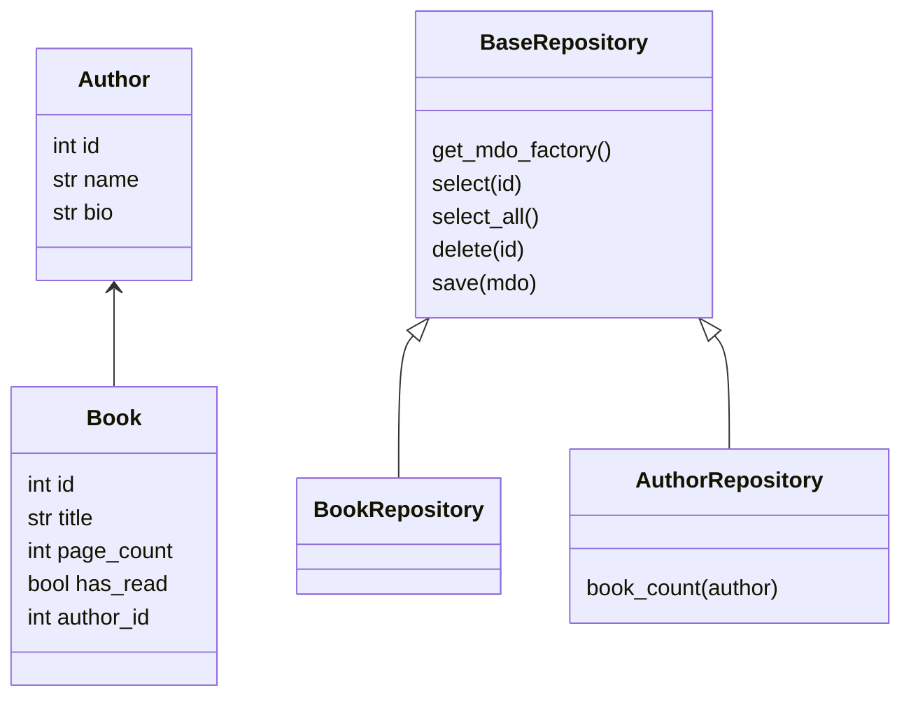

# Little Books Database

## Diagrams

# Class diagram

```mermaid
classDiagram
Author <-- Book
Author : int id
Author : str name
Author : str bio
Book : int id
Book : str title
Book : int page_count
Book : bool has_read
Book : int author_id
class BaseRepository {
    get_mdo_factory()
    select(id)
    select_all()
    delete(id)
    save(mdo)
}
BaseRepository <|-- BookRepository
BaseRepository <|-- AuthorRepository
AuthorRepository : book_count(author)
```

## Screenshots

