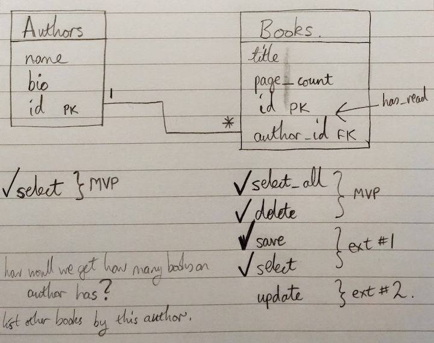
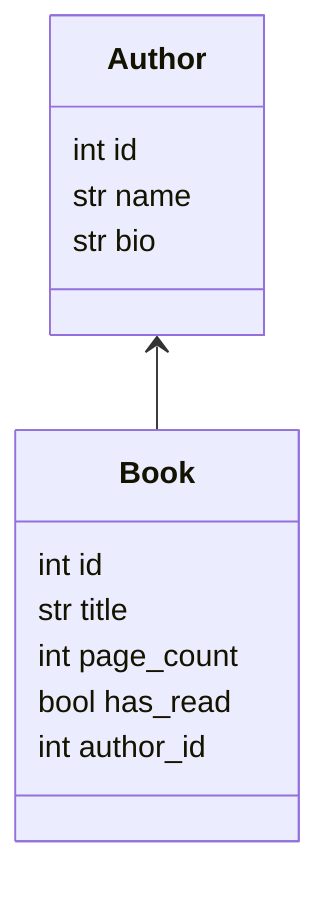

# Little Books Database

## Diagrams

# Class diagram

```mermaid
classDiagram
Author <-- Book
Author : int id
Author : str name
Author : str bio
Book : int id
Book : str title
Book : int page_count
Book : bool has_read
Book : int author_id
```

## Screenshots

